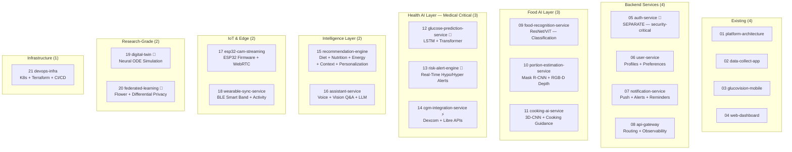
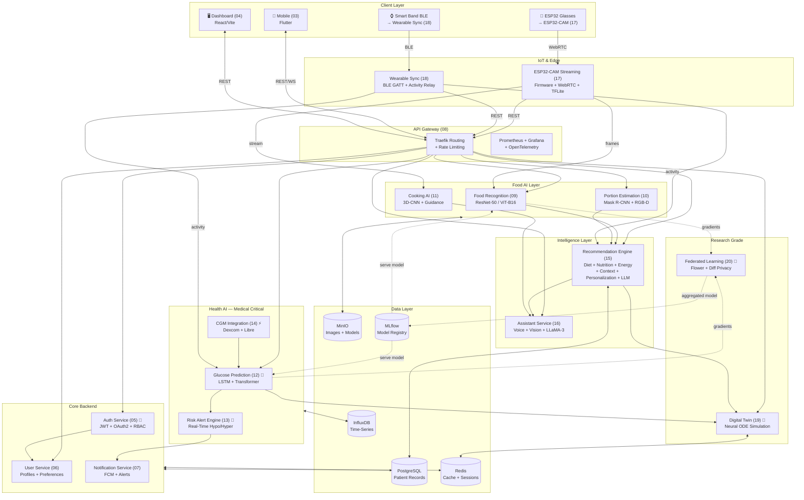
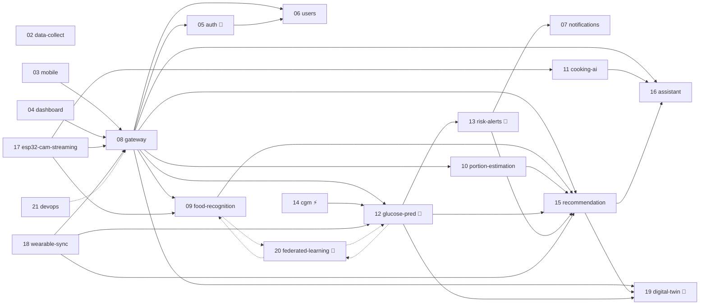
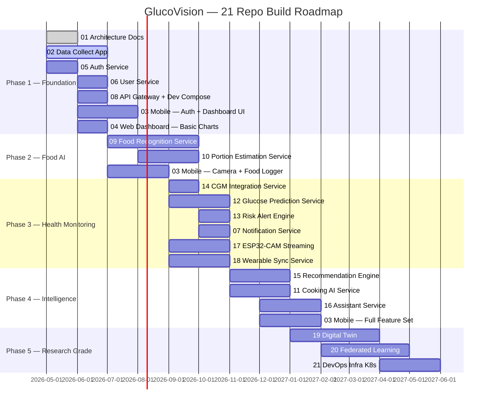

# GlucoVision — 21-Repo Architecture Plan

> Based on: *Systematic Review of AI-Based PDAR System for Diabetic Individuals*
> Strategy: Separate when it matters, consolidate when it doesn't.

---

## 🔍 Separation of Concerns Principle

| Reason to Separate | Applies To |
|---|---|
| 🔴 **Medical Safety** | Glucose prediction, Risk engine — bugs harm patients |
| 🔐 **Security-Critical** | Auth — must be independently auditable |
| ⚡ **Real-Time / Different SLA** | CGM integration, Risk alerts |
| 🧠 **Different AI Runtime** | Vision (GPU) vs Time-Series (GPU) vs LLM |
| 🔬 **Research / Experimental** | Digital twin, Federated learning |
| 🏗️ **Cross-Cutting Infra** | API gateway, DevOps |

---

## 📦 All 21 Repositories

---

## 🗂️ Repo Details

### `01` platform-architecture *(Existing)*
Docs, OpenAPI specs, Mermaid diagrams, ADRs, service communication maps.

### `02` data-collect-app *(Existing — Active)*
Flutter capture app + FastAPI backend for Sri Lankan food image collection. Keep as-is.

### `03` glucovision-mobile *(Existing — Expand)*
Flutter modules: food logger, AR portion overlay, BLE wearable sync, glucose tracker, recommendations, digital twin view, notifications.

### `04` web-dashboard *(Existing — Expand)*
React/Vite: patient analytics, glucose/activity charts, model monitoring, FL status, digital twin studio.

---

### `05` auth-service 🔐 *(SEPARATE — Security Critical)*
**Why**: Security CVEs have their own lifecycle. A JWT vulnerability must be patchable and deployable without touching any other service.

| Module | Features |
|---|---|
| `auth/` | JWT issue/refresh/revoke, OAuth2 |
| `rbac/` | Roles: patient, clinician, admin, researcher |
| `mfa/` | TOTP / biometric token |

Tech: FastAPI + Redis (token blacklist) + PostgreSQL

---

### `06` user-service
**Why separate from auth**: User profiles have different change rate than auth security logic. Pure domain CRUD.

| Module | Features |
|---|---|
| `profiles/` | Name, DOB, diabetes type, HbA1c target |
| `preferences/` | Cultural food preferences, language (Sinhala/Tamil) |
| `health_metadata/` | BMI, weight history, medication list |

Tech: FastAPI + PostgreSQL

---

### `07` notification-service
Async push service — owns its own queue, decoupled from request path.

| Module | Features |
|---|---|
| `push/` | FCM / APNs push delivery |
| `alerts/` | Glucose threshold alerts (from risk engine) |
| `reminders/` | Meal + medication reminders |
| `templates/` | Sinhala/Tamil localized copy |

Tech: FastAPI + Celery + Redis + FCM

---

### `08` api-gateway
Central routing + all observability. Merged with observability because metrics/tracing are gateway config.

| Module | Features |
|---|---|
| `gateway/` | Traefik routing, rate limiting, auth forwarding |
| `monitoring/` | Prometheus + Grafana dashboards |
| `tracing/` | OpenTelemetry distributed traces |
| `compose/` | Master `docker-compose.yml` for dev |

Tech: Traefik + Prometheus + Grafana + OpenTelemetry

---

### `09` food-recognition-service *(GPU — Classification)*
**Why separate from portion estimation**: 2D classification (what is it?) vs 3D geometry (how much?) are fundamentally different model architectures, datasets, and inference profiles.

| Module | Model | Paper Ref |
|---|---|---|
| `classifier/` | ResNet-50 / ViT-B16 | [4][34] — 91–93% acc |
| `sinhala_finetune/` | Sri Lankan cuisine fine-tune | Custom dataset |
| `nutrition_lookup/` | Food ID → macros (Nutrition5k) | [4][35] |

Tech: FastAPI + PyTorch + ONNX Runtime + MinIO

---

### `10` portion-estimation-service *(GPU — Geometry + Depth)*
**Why separate from food recognition**: Depth sensing, 3D reconstruction, and AR geometry are a completely different engineering domain.

| Module | Model | Paper Ref |
|---|---|---|
| `ingredient_detection/` | Mask R-CNN segmentation | [5] — 94.1% IoU |
| `depth_estimation/` | RGB-D depth inference | [11][12] |
| `volume_calculator/` | 3D volume → weight (g) | [12][13] |
| `ar_guidance/` | AR overlay data for mobile | [14][16] |

Tech: FastAPI + PyTorch + Open3D

---

### `11` cooking-ai-service *(GPU — Temporal Vision)*
**Why**: Video/temporal 3D-CNN models differ architecturally from static image models. Runs on continuous stream.

| Module | Features |
|---|---|
| `cooking_state/` | Detect frying/boiling/steaming — 3D-CNN |
| `step_detector/` | Recipe step completion |
| `cooking_guidance/` | Real-time step-by-step cooking API |

Tech: FastAPI + PyTorch (3D-CNN) + WebSocket

---

### `12` glucose-prediction-service 🔴 *(SEPARATE — Medically Critical)*
**Why**: Predicts patient blood glucose. A bug, model drift, or deployment error has direct clinical consequences. Needs:
- Independent rollback
- Own model versioning lifecycle
- Separate drift monitoring (MAPE alerts)
- Independent scaling (high CGM polling volume)

| Module | Model | Paper Ref |
|---|---|---|
| `lstm_model/` | Bi-LSTM glucose forecasting | [23][24] |
| `transformer_model/` | Time-series Transformer | [25][26] |
| `ensemble/` | LSTM + Transformer aggregation | [24] |
| `preprocessing/` | Sliding window, imputation | [27] |

Tech: FastAPI + PyTorch + InfluxDB + MLflow

---

### `13` risk-alert-engine 🔴 *(SEPARATE — Real-Time Safety)*
**Why**: Fires hypoglycemia/hyperglycemia alerts. Must have sub-second latency, independent uptime SLA, zero downtime tolerance.

| Module | Features |
|---|---|
| `threshold_monitor/` | Real-time glucose evaluation |
| `hypo_detector/` | Hypoglycemia prediction + alert trigger |
| `hyper_detector/` | Hyperglycemia trend alert |
| `postmeal_validator/` | Post-meal prediction vs actual loop |
| `alert_publisher/` | Kafka/WebSocket → notification service |

Tech: FastAPI + Kafka + Redis + WebSocket

---

### `14` cgm-integration-service ⚡ *(SEPARATE — Real-Time Medical API)*
**Why**: Talks to live medical device APIs (Dexcom, Libre) with vendor-specific OAuth, rate limits, and polling loops entirely different from rest of platform.

| Module | Features |
|---|---|
| `dexcom/` | Dexcom G6/G7 OAuth + data polling |
| `libre/` | Abbott FreeStyle Libre integration |
| `manual_entry/` | Manual glucose log fallback |
| `normalizer/` | All CGM formats → mmol/L |
| `influx_writer/` | Stream to InfluxDB |

Tech: FastAPI + HTTPX + InfluxDB + Celery

---

### `15` recommendation-engine
**Why consolidated**: Diet, nutrition, energy, context, and personalization are a sequential pipeline — none function without the others. Splitting them creates fake microservices.

| Module | Features |
|---|---|
| `nutrition_engine/` | Macro calc, GI index, Sri Lankan food rules |
| `energy_engine/` | BMR + activity factor → TDEE |
| `diet_recommendation/` | Personalized Sri Lankan meal plans |
| `activity_recommendation/` | Home workout plans |
| `context_engine/` | Holistic signal fusion (food + glucose + activity) |
| `personalization/` | RL-based user-specific adaptation |
| `llm_advisory/` | LLaMA-3 dietary chat |

Tech: FastAPI + LangChain + LLaMA-3 + PostgreSQL

---

### `16` assistant-service
**Why consolidated**: Voice, vision Q&A, and cooking guidance are three UI modes of one multimodal assistant — not three separate products.

| Module | Features |
|---|---|
| `voice/` | Whisper ASR → intent → TTS response |
| `vision_qa/` | Camera Q&A via LLaMA-3 Vision |
| `multimodal_fusion/` | Combined voice + camera context |

Tech: FastAPI + Whisper + LLaMA-3-Vision + WebSocket

---

### `17` esp32-cam-streaming-service
**Why separate from wearable sync**: Camera firmware lifecycle (ESP-IDF, OTA, MJPEG, WebRTC) and video streaming infrastructure are a completely different engineering domain from BLE protocol handling and GATT characteristic parsing.

| Module | Features |
|---|---|
| `esp32_firmware/` | ESP32-CAM firmware, WiFi provisioning, BLE config, deep sleep (C++) |
| `mjpeg_server/` | Lightweight MJPEG HTTP stream on ESP32 hardware |
| `webrtc_relay/` | Python aiortc relay: MJPEG → WebRTC to mobile + cloud |
| `edge_inference/` | On-device TFLite MobileNetV3 food recognition (offline fallback) |
| `ota_manager/` | Signed OTA firmware delivery over HTTPS |
| `mqtt_bridge/` | ESP32 telemetry + command channel |

Tech: C++ (ESP-IDF) + Python (aiortc) + WebRTC + MQTT

---

### `18` wearable-sync-service
**Why separate from ESP32 streaming**: BLE GATT protocol handling, multi-device band profiles, and activity data normalisation are independent of camera firmware — different hardware, different protocols, different data domain.

| Module | Features |
|---|---|
| `ble_gateway/` | BLE central: scan, connect, bond to smart bands |
| `gatt_parser/` | Parse GATT characteristics: HR (0x2A37), steps, SpO2 (0x2A5F), battery |
| `band_profiles/` | Per-device profiles: Xiaomi Mi Band, Fitbit, generic HRS |
| `activity_normaliser/` | Unify band formats → standard activity schema |
| `activity_relay/` | Push normalised activity to `15` recommendation + `12` glucose prediction |
| `realtime_stream/` | WebSocket live HR during exercise sessions |

Tech: Flutter (flutter_blue_plus) + Python (bleak / FastAPI) + InfluxDB

---

### `19` digital-twin 🔬 *(SEPARATE — Research Grade)*
**Why**: Neural ODE / physiological simulation is experimental with its own training lifecycle, different from production inference.

| Module | Features |
|---|---|
| `twin_engine/` | Patient state model (glucose, BMI, HbA1c) |
| `simulation_api/` | What-if meal/exercise scenario runner |
| `forecasting/` | Neural ODE 24–72hr health projections |
| `data_sync/` | Real-time feed from `12` + `15` |
| `viz_api/` | Chart data endpoints for mobile + web |

Tech: FastAPI + torchdiffeq (Neural ODE) + InfluxDB + Redis

---

### `20` federated-learning 🔬 *(SEPARATE — Privacy Critical)*
**Why**: Different infrastructure topology, separate regulatory compliance (GDPR/HIPAA), different deployment lifecycle entirely.

| Module | Features |
|---|---|
| `fl_server/` | Flower FedAvg/FedProx aggregation |
| `fl_client/` | Per-institution training client SDK |
| `privacy/` | Differential privacy (ε-DP noise) |
| `secure_agg/` | Encrypted gradient aggregation |
| `experiment_tracker/` | FL round metrics, convergence monitoring |

Tech: Flower (flwr) + PyTorch + OpenMined PySyft

---

### `21` devops-infra
**Why**: Infrastructure-as-code deploys all other repos — belongs in its own isolated repo.

| Module | Features |
|---|---|
| `docker/` | Dockerfiles for all 21 services |
| `kubernetes/` | Helm charts, namespaces, ingress |
| `terraform/` | Cloud infra provisioning |
| `ci-cd/` | GitHub Actions per service |
| `secrets/` | Vault config, env templates |

---

## 🏗️ Full System Architecture (21 Repos)

---

## 🔗 Service Dependency Graph

---

## 🧠 Decision Table: 31 → 21

| Your Original Repo (31) | Goes Into | Reason |
|---|---|---|
| auth-service | **`05` SEPARATE** 🔐 | Security-critical, independent audit + rollback |
| user-service | `06` user-service | Kept — pure domain CRUD, different change rate |
| notification-service | `07` notification-service | Kept — owns async queue + FCM |
| api-gateway | `08` api-gateway | Kept + merged observability (metrics = gateway config) |
| observability | → merged into `08` | Not a service, it's gateway configuration |
| food-recognition | **`09` SEPARATE** | Different architecture from portion (2D classify ≠ 3D geometry) |
| ingredient-detection | → merged into `10` | Same depth/geometry pipeline as portion estimation |
| portion-estimation | **`10` SEPARATE** | Different from food recognition — geometry + depth domain |
| cooking-state-ai | → merged into `11` | Same temporal video pipeline as cooking assistant |
| cooking-assistant | `11` cooking-ai | Merged with cooking-state-ai (same 3D-CNN + stream domain) |
| glucose-prediction | **`12` SEPARATE** 🔴 | Medically critical — clinical consequences, own lifecycle |
| risk-engine | **`13` SEPARATE** 🔴 | Real-time safety SLA, independent uptime |
| postmeal-analysis | → merged into `13` | Sub-module of risk validation loop |
| cgm-integration | **`14` SEPARATE** ⚡ | Live medical device API, unique failure modes |
| diet-recommendation | → merged into `15` | Inseparable from nutrition + energy pipeline |
| nutrition-engine | → merged into `15` | Sequential pipeline step |
| energy-engine | → merged into `15` | Sequential pipeline step |
| context-engine | → merged into `15` | Sequential pipeline step |
| personalization-engine | → merged into `15` | Sequential pipeline step |
| voice-assistant | → merged into `16` | One mode of multimodal assistant |
| vision-assistant | → merged into `16` | One mode of multimodal assistant |
| esp32-glasses | **`17` SEPARATE** | Camera firmware + WebRTC streaming ≠ BLE wearable domain |
| edge-streaming | → merged into `17` | Same real-time video streaming pipeline as ESP32-CAM |
| wearable-sync | **`18` SEPARATE** | BLE GATT protocol handling is independent of camera firmware |
| digital-twin | **`19` SEPARATE** 🔬 | Research-grade, different Neural ODE runtime |
| simulation-engine | → merged into `19` | Simulation IS the twin — not a separate product |
| federated-learning | **`20` SEPARATE** 🔬 | Privacy-critical, separate infra + compliance surface |
| devops | `21` devops-infra | Kept — deploys everything else |

---

## 📈 Build Order & Complexity

| Priority | Repo | ⭐ Difficulty | Depends On | Demo Value | Flag |
|---|---|---|---|---|---|
| 1 | `01` platform-architecture | ⭐ | — | Medium | — |
| 2 | `02` data-collect-app | ⭐⭐ | — | **Very High** | — |
| 3 | `05` auth-service | ⭐⭐ | — | Low | 🔐 |
| 4 | `06` user-service | ⭐⭐ | 05 | Low | — |
| 5 | `08` api-gateway | ⭐⭐ | 05 | Low | — |
| 6 | `03` mobile-app | ⭐⭐ | 05,06,08 | **Very High** | — |
| 7 | `04` web-dashboard | ⭐⭐ | 05,06,08 | **Very High** | — |
| 8 | `07` notification-service | ⭐⭐ | 05,13 | Low | — |
| 9 | `09` food-recognition | ⭐⭐⭐ | 08 | **Very High** | — |
| 10 | `14` cgm-integration | ⭐⭐⭐ | 08 | High | ⚡ |
| 11 | `17` esp32-cam-streaming | ⭐⭐⭐ | 08 | High | — |
| 11 | `18` wearable-sync | ⭐⭐⭐ | 08 | High | — |
| 12 | `10` portion-estimation | ⭐⭐⭐ | 09 | High | — |
| 13 | `12` glucose-prediction | ⭐⭐⭐⭐ | 14 | High | 🔴 |
| 14 | `13` risk-alert-engine | ⭐⭐⭐⭐ | 12,07 | High | 🔴 |
| 15 | `11` cooking-ai | ⭐⭐⭐⭐ | 09 | High | — |
| 16 | `15` recommendation-engine | ⭐⭐⭐⭐ | 09,12,13 | **Very High** | — |
| 17 | `16` assistant-service | ⭐⭐⭐⭐ | 09,15 | **Very High** | — |
| 18 | `19` digital-twin | ⭐⭐⭐⭐⭐ | 12,15 | High | 🔬 |
| 19 | `20` federated-learning | ⭐⭐⭐⭐⭐ | 09,12 | High | 🔬 |
| 20 | `21` devops-infra | ⭐⭐⭐⭐ | all | Low | — |

---

## 🗺️ Development Phases

---

> [!IMPORTANT]
> **`05-auth-service` first** — every other service depends on it. Build it standalone and clean.

> [!TIP]
> **`09-food-recognition` is your fastest AI win** — start with ResNet-50 on Food-101 public dataset, then fine-tune on your Sri Lankan data from `02`.

> [!WARNING]
> **`12` and `13` must never share a deployment unit** — glucose prediction and risk alerts need independent rollback capability due to medical safety implications.

> [!NOTE]
> **`19-digital-twin` and `20-federated-learning`** are your research differentiators. The paper calls these the frontier of diabetes management. Plan their data contracts (InfluxDB schema, model gradient format) early even if you build them last.
