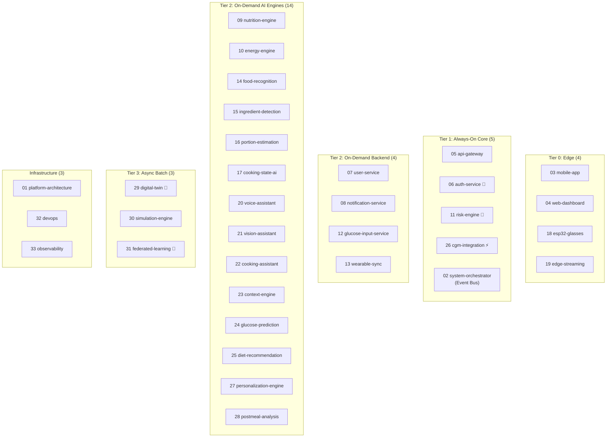
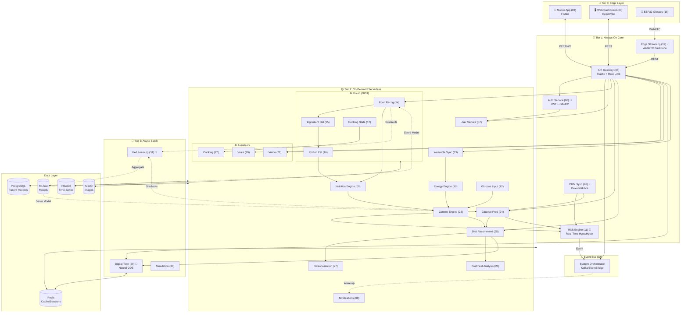
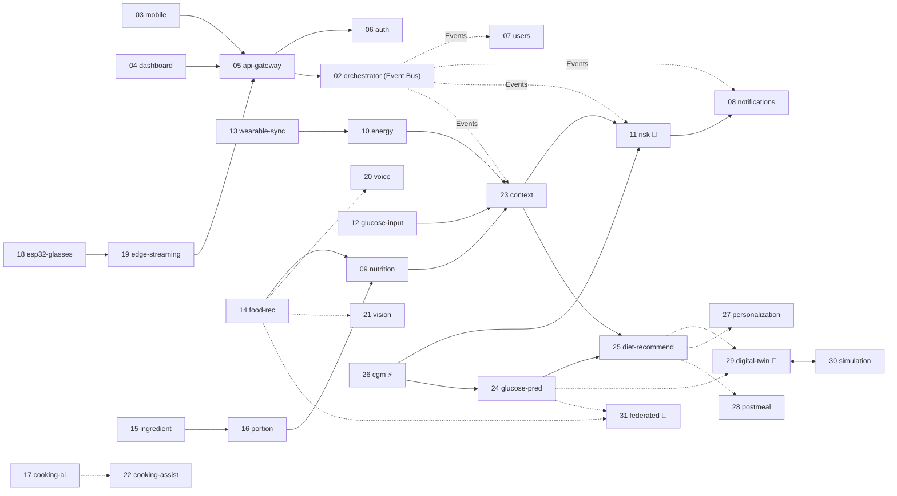
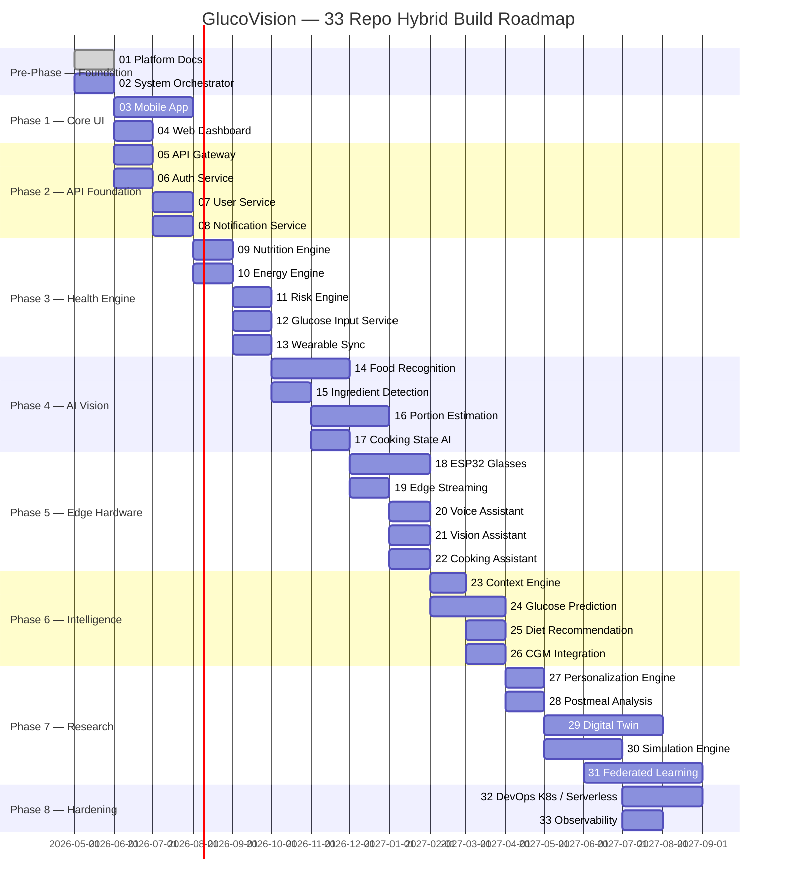

# GlucoVision — 33-Repo Hybrid Architecture Plan

> Based on: *Systematic Review of AI-Based PDAR System for Diabetic Individuals*
> Strategy: Resource-efficient scaling via Always-On Core vs. On-Demand Serverless Tiers.

---

## 🔍 Hybrid Separation of Concerns

| Tier | Reason to Separate | Applies To |
|---|---|---|
| 🔴 **Tier 1: Always-On Core** | Medical safety, constant uptime, low latency routing | Gateways, Auth, Risk Engine, CGM sync, Live Video |
| 🟡 **Tier 2: On-Demand Serverless** | Resource optimization, Scale-to-Zero, event-triggered | AI Vision, Notification, User profiles, Nutrition engines |
| 🔵 **Tier 3: Async Batch** | Heavy compute, non-time-critical research | Digital Twin, Federated Learning |
| 📱 **Tier 0: Edge & Clients** | Device-side processing, UI rendering | Mobile, Web, ESP32 hardware |

---

## 📦 All 33 Repositories

---

## 🗂️ Repo Details

### `01` platform-architecture *(Existing)*
Docs, OpenAPI specs, Mermaid diagrams, ADRs, hybrid architecture contracts.

### `02` system-orchestrator *(MASTER BRAIN — Tier 1)*
**Why**: Defines system rules before services exist. Central event registry.
| Module | Features |
|---|---|
| `registry/` | Service discovery and routing logic |
| `event_bus/` | Kafka schema definitions |

### `03` mobile-app *(Edge)*
Flutter app: UI structure, camera flow, food logger, AR overlays.

### `04` web-dashboard *(Edge)*
React/Vite: Patient analytics, glucose charts, model monitoring.

---

### `05` api-gateway *(Tier 1: Always-On)*
Everything flows through this. Must be up 24/7.
| Module | Features |
|---|---|
| `gateway/` | Traefik routing, rate limiting |
Tech: Traefik

### `06` auth-service 🔐 *(Tier 1: Always-On)*
Security-critical identity service.
| Module | Features |
|---|---|
| `auth/` | JWT issue/refresh, OTP system |
Tech: FastAPI + Redis + PostgreSQL

### `07` user-service *(Tier 2: Serverless)*
| Module | Features |
|---|---|
| `profiles/` | Profiles, healthcare metadata |
Tech: FastAPI + PostgreSQL

### `08` notification-service *(Tier 2: Serverless)*
| Module | Features |
|---|---|
| `push/` | OTP emails, push alerts, reminders |
Tech: FastAPI + Celery + FCM

---

### `09` nutrition-engine *(Tier 2: Serverless)*
| Module | Features |
|---|---|
| `nutrition/` | Base logic for macros and diet AI |
Tech: FastAPI + PostgreSQL

### `10` energy-engine *(Tier 2: Serverless)*
| Module | Features |
|---|---|
| `energy/` | Calorie burn logic based on user data |
Tech: FastAPI

### `11` risk-engine 🔴 *(Tier 1: Always-On)*
Needs continuous uptime for hypo/hyper detection.
| Module | Features |
|---|---|
| `monitor/` | Real-time glucose thresholds |
Tech: FastAPI + Redis

### `12` glucose-input-service *(Tier 2: Serverless)*
| Module | Features |
|---|---|
| `input/` | Manual glucose entry API |
Tech: FastAPI

### `13` wearable-sync *(Tier 2: Serverless)*
| Module | Features |
|---|---|
| `sync/` | Syncs data from Samsung Fit/Health Connect |
Tech: FastAPI

---

### `14` food-recognition *(Tier 2: GPU)*
| Module | Model | Paper Ref |
|---|---|---|
| `classifier/` | ResNet-50 / ViT-B16 | [4][34] — 91–93% acc |
Tech: FastAPI + PyTorch

### `15` ingredient-detection *(Tier 2: GPU)*
| Module | Model | Paper Ref |
|---|---|---|
| `segmentation/`| Mask R-CNN | [5] |
Tech: FastAPI + PyTorch

### `16` portion-estimation *(Tier 2: GPU)*
| Module | Model | Paper Ref |
|---|---|---|
| `volume/` | RGB-D Depth Volume | [11][12] |
Tech: FastAPI + PyTorch + Open3D

### `17` cooking-state-ai *(Tier 2: GPU)*
| Module | Features |
|---|---|
| `state/` | 3D-CNN temporal logic |
Tech: FastAPI + PyTorch

---

### `18` esp32-glasses *(Edge)*
| Module | Features |
|---|---|
| `firmware/` | Hardware firmware base |
Tech: C++ (ESP-IDF)

### `19` edge-streaming *(Tier 1: Always-On)*
| Module | Features |
|---|---|
| `webrtc/` | Backbone for glasses + mobile streaming |
Tech: Python (aiortc)

### `20` voice-assistant *(Tier 2: Serverless)*
| Module | Features |
|---|---|
| `voice/` | Whisper ASR → intent |
Tech: FastAPI + Whisper

### `21` vision-assistant *(Tier 2: Serverless)*
| Module | Features |
|---|---|
| `vision/` | Combines camera + LLaMA-3 Vision |
Tech: FastAPI + LLaMA-3-Vision

### `22` cooking-assistant *(Tier 2: Serverless)*
| Module | Features |
|---|---|
| `assistant/` | Real-world AI helper |
Tech: FastAPI

---

### `23` context-engine *(Tier 2: Serverless)*
| Module | Features |
|---|---|
| `context/` | Central brain / Data fusion |
Tech: FastAPI

### `24` glucose-prediction *(Tier 2: Serverless)*
| Module | Model | Paper Ref |
|---|---|---|
| `forecast/` | LSTM + Transformer | [23][24] |
Tech: FastAPI + PyTorch

### `25` diet-recommendation *(Tier 2: Serverless)*
| Module | Features |
|---|---|
| `recommend/` | Personalized AI system |
Tech: FastAPI + LangChain

### `26` cgm-integration ⚡ *(Tier 1: Always-On)*
| Module | Features |
|---|---|
| `cgm/` | Polling Dexcom/Libre loops |
Tech: FastAPI + InfluxDB

---

### `27` personalization-engine *(Tier 2: Serverless)*
| Module | Features |
|---|---|
| `adapt/` | Behavior adaptation layer |
Tech: FastAPI + RL

### `28` postmeal-analysis *(Tier 2: Serverless)*
| Module | Features |
|---|---|
| `analysis/` | Feedback learning loop (2hrs post-meal) |
Tech: FastAPI

### `29` digital-twin 🔬 *(Tier 3: Batch)*
| Module | Features |
|---|---|
| `twin/` | Virtual metabolic model (Neural ODE) |
Tech: FastAPI + torchdiffeq

### `30` simulation-engine *(Tier 3: Batch)*
| Module | Features |
|---|---|
| `sim/` | What-if prediction system |
Tech: FastAPI

### `31` federated-learning 🔬 *(Tier 3: Batch)*
| Module | Features |
|---|---|
| `fl_server/` | Privacy-preserving distributed learning |
Tech: Flower (flwr)

---

### `32` devops *(Infra)*
| Module | Features |
|---|---|
| `k8s/` | CI/CD + deployment |

### `33` observability *(Infra)*
| Module | Features |
|---|---|
| `metrics/` | Prometheus, Grafana, Tracing |

---

## 🏗️ Full System Architecture (Detailed Hybrid Topology)

---

## 🔗 Service Dependency Graph

---

## 📈 Build Order & Complexity

| Priority | Repo | ⭐ Difficulty | Phase | Demo Value |
|---|---|---|---|---|
| 1 | `01` platform-architecture | ⭐ | Pre-Phase | — |
| 2 | `02` system-orchestrator | ⭐⭐ | Pre-Phase | — |
| 3 | `03` mobile-app | ⭐⭐ | Phase 1 | **Very High** |
| 4 | `04` web-dashboard | ⭐⭐ | Phase 1 | **Very High** |
| 5 | `05` api-gateway | ⭐⭐ | Phase 2 | Low |
| 6 | `06` auth-service | ⭐⭐ | Phase 2 | Low |
| 7 | `07` user-service | ⭐⭐ | Phase 2 | Low |
| 8 | `08` notification-service | ⭐⭐ | Phase 2 | Low |
| 9 | `09` nutrition-engine | ⭐⭐⭐ | Phase 3 | High |
| 10 | `10` energy-engine | ⭐⭐⭐ | Phase 3 | High |
| 11 | `11` risk-engine | ⭐⭐⭐⭐ | Phase 3 | High |
| 12 | `12` glucose-input-service | ⭐⭐ | Phase 3 | High |
| 13 | `13` wearable-sync | ⭐⭐⭐ | Phase 3 | High |
| 14 | `14` food-recognition | ⭐⭐⭐ | Phase 4 | **Very High** |
| 15 | `15` ingredient-detection | ⭐⭐⭐ | Phase 4 | High |
| 16 | `16` portion-estimation | ⭐⭐⭐ | Phase 4 | High |
| 17 | `17` cooking-state-ai | ⭐⭐⭐⭐ | Phase 4 | High |
| 18 | `18` esp32-glasses | ⭐⭐⭐ | Phase 5 | High |
| 19 | `19` edge-streaming | ⭐⭐⭐ | Phase 5 | High |
| 20 | `20` voice-assistant | ⭐⭐⭐ | Phase 5 | High |
| 21 | `21` vision-assistant | ⭐⭐⭐⭐ | Phase 5 | High |
| 22 | `22` cooking-assistant | ⭐⭐⭐⭐ | Phase 5 | High |
| 23 | `23` context-engine | ⭐⭐⭐⭐ | Phase 6 | High |
| 24 | `24` glucose-prediction | ⭐⭐⭐⭐ | Phase 6 | High |
| 25 | `25` diet-recommendation | ⭐⭐⭐⭐ | Phase 6 | **Very High** |
| 26 | `26` cgm-integration | ⭐⭐⭐ | Phase 6 | High |
| 27 | `27` personalization-engine | ⭐⭐⭐⭐ | Phase 7 | High |
| 28 | `28` postmeal-analysis | ⭐⭐⭐ | Phase 7 | High |
| 29 | `29` digital-twin | ⭐⭐⭐⭐⭐ | Phase 7 | High |
| 30 | `30` simulation-engine | ⭐⭐⭐⭐ | Phase 7 | High |
| 31 | `31` federated-learning | ⭐⭐⭐⭐⭐ | Phase 7 | High |
| 32 | `32` devops | ⭐⭐⭐⭐ | Phase 8 | Low |
| 33 | `33` observability | ⭐⭐⭐ | Phase 8 | Low |

---

## 🗺️ Development Phases

