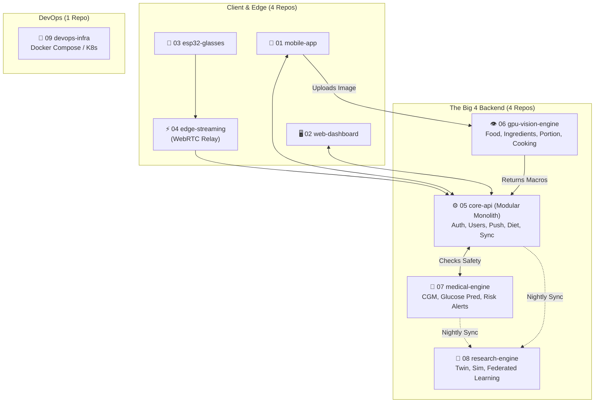

# GlucoVision — The "Macro-Service" (Modular Monolith) Architecture

> Strategy: The absolute easiest and fastest way to build the platform. Optimize for developer velocity and minimal infrastructure overhead.

---

## 🧠 Why Macro-Services?
The 33-repo (Serverless) and 21-repo (Microservices) architectures are theoretically pure, but they require a massive DevOps team to manage CI/CD pipelines, Kafka events, distributed tracing, and network latency.

If you want the **easiest and fastest** way to build this project today, you should use a **Macro-Service Architecture** (also known as a system of Modular Monoliths). 

Instead of separating by *business domain*, we separate strictly by **Computational Constraints and Safety SLAs**. We consolidate the 33 ideas down into just **4 Backend Repositories** (The "Big 4").

---

## 📦 The "Big 4" Architecture

---

## 🗂️ The 9 Total Repositories

### 1-4. The Edge Repos
* `01-glucovision-mobile` (Flutter)
* `02-glucovision-web-dashboard` (React/Vite)
* `03-glucovision-esp32-glasses` (C++ Firmware)
* `04-glucovision-edge-streaming` (Python WebRTC relay — separated because it holds stateful continuous connections).

### 5. `05-glucovision-core-api` (The Modular Monolith)
**This is where you will spend 80% of your time coding.** It is a single FastAPI application. Because everything is in one repo, functions can call each other in RAM (zero network latency).
* **Modules Inside**:
  * `/auth` (JWT, OTP)
  * `/users` (Profiles, Preferences)
  * `/notifications` (FCM)
  * `/recommendations` (Nutrition, Energy, Context, Diet LLM)
  * `/assistants` (Voice/Vision wrappers)
  * `/wearable_sync` (Mobile API endpoints for Samsung Fit)
* **Tech**: FastAPI + PostgreSQL + Redis.

### 6. `06-glucovision-gpu-vision` (The AI Engine)
**Why isolated?** PyTorch and Computer Vision models require massive GPU servers. You don't want to pay for GPU RAM to run basic User Authentication.
* **Modules Inside**:
  * `/food_recognition` (ResNet)
  * `/ingredient_detection` (Mask R-CNN)
  * `/portion_estimation` (RGB-D Depth)
  * `/cooking_state` (3D-CNN)
* **Tech**: FastAPI + PyTorch + CUDA.

### 7. `07-glucovision-medical-engine` 🔴 (Safety Critical)
**Why isolated?** This code can hurt a patient if it crashes. It must have its own isolated deployment that never goes down, even if the Core API crashes.
* **Modules Inside**:
  * `/cgm_integration` (Dexcom/Libre loops)
  * `/glucose_prediction` (LSTM time-series)
  * `/risk_alerts` (Hypo/Hyper real-time monitoring)
* **Tech**: FastAPI + InfluxDB.

### 8. `08-glucovision-research-engine` 🔬 (Background Batch)
**Why isolated?** These are massive computational jobs that run overnight and don't need to respond to user web requests in milliseconds.
* **Modules Inside**:
  * `/digital_twin` (Neural ODE physiological models)
  * `/federated_learning` (Flower PySyft aggregators)
  * `/simulation` (What-if scenario runners)
* **Tech**: PyTorch + Flower + Background Workers.

### 9. `09-glucovision-devops`
* Helm charts, Docker Compose files, Terraform.

---

## 🏆 Why is this the BEST approach for you?

1. **Massive Developer Velocity**: If you want to change how Nutrition logic impacts the Diet logic, you just edit two Python files in the `core-api` repo. In the 33-repo model, you would have to update 3 repos, 3 API contracts, and a Kafka event schema.
2. **Easy Local Testing**: You can run the entire GlucoVision backend on your laptop with a single `docker-compose up` command (spinning up Core, DBs, and mock Medical/Vision engines).
3. **Smart Cost Optimization**: You only pay for expensive GPUs for Repo 06. The standard CRUD app (Repo 05) runs on a cheap $10/month CPU server.
4. **Preserves Medical Safety**: The most important rule of the PDAR paper is kept intact — the Medical Risk Engine (Repo 07) is physically isolated from the rest of the app.

---

## 📈 Easiest Build Roadmap

| Phase | What to Build | Goal |
|---|---|---|
| **Phase 1** | `01-mobile` + `05-core-api` (Auth/Users only) | Get users logging into the app. |
| **Phase 2** | `05-core-api` (Recommendations) | Get standard text/data flowing. |
| **Phase 3** | `06-gpu-vision` | Connect the camera to AI food tracking. |
| **Phase 4** | `07-medical-engine` | Hook up real-time glucose and safety alerts. |
| **Phase 5** | Hardware (`03`, `04`) | Add ESP32 Smart Glasses streaming. |
| **Phase 6** | `08-research-engine` | Add the advanced science (Digital Twin / FL). |
